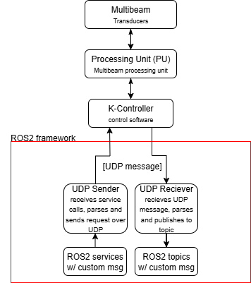

# Kongsberg EM Multibeam EchoSounder ROS2 wrapper

This package provides a simple, unified ROS2 interface for controlling and monitoring Kongsberg EM Multibeam EchoSounder devices. It wraps UDP communication and exposes ROS2 services and topics for easy integration with your K-Controller.

An EM multibeam is a sophisticated sonar system used to map the seafloor with high accuracy. Developed by Kongsberg, it works by emitting multiple acoustic beams in a fan-shaped pattern from a transducer mounted on a vessel. These beams bounce off the seabed and return to the receiver, allowing the system to calculate depth and topography based on the time and angle of the returning signals. Unlike single-beam echo sounders, EM multibeam systems can cover a wide swath of the ocean floor in a single pass, making them ideal for hydrographic surveys, underwater research, and marine navigation. Their high resolution and reliability make them a preferred choice for both shallow coastal mapping and deep-sea exploration.

**Note: This is a student-written project developed as part of academic work.**

**Disclaimer: This wrapper is developed and tested only with ROS2 Jazzy distribution inside WSL2 on a windows computer.**


## Table of Contents
- [Features](#features)
- [Process](#process)
- [Prerequisites & Setup](#prerequisites--setup)
- [Workspace Setup](#workspace-setup)
- [Quick Start](#quick-start)
- [Configuration Methods](#configuration-methods)
- [Services](#services)
- [Topics](#topics)
- [Typical Workflow](#typical-workflow)
- [Troubleshooting](#troubleshooting)
- [Advanced Usage](#advanced-usage)
- [Shell Aliases for Simplified Service Calls](#shell-aliases-for-simplified-service-calls)
- [Example Workflow with Aliases](#example-workflow-with-aliases)
- [Support](#support)
- [License](#license)


## Features

- **Flexible Configuration**: Multiple ways to run the wrapper with default or custom parameters
- **ROS2 Services**: Control sounders, manage parameters, start/stop recording, and more.
- **ROS2 Topics**: Receive device status, detected devices, multicast info, warnings/errors, and PU parameters.

## Process
The wrapper utilizes UDP communication with the K-Controller software, which in turn communicates with the Multibeam Processing Unit (PU). Between them a message structure is used to identify the command. In each end this message structure and data is parsed. On the ROS2 end this is parsed to, or from, a custom message for ease of use in further development. 




## Prerequisites & Setup

Before using this package, ensure the following are installed and set up:

### 1. ROS2

You need a ROS2 distribution installed on your system. This wrapper is developed, and tested, using ROS2 jazzy
Follow the official installation guide:  
[ROS2 Jazzy Installation Guide (Ubuntu)](https://docs.ros.org/en/jazzy/Installation/Ubuntu-Install-Debians.html)

### 2. Colcon Build System

Colcon is required to build ROS2 workspaces.  
Install with:

```bash
sudo apt install python3-colcon-common-extensions
```
[Colcon Documentation](https://colcon.readthedocs.io/en/released/user/installation.html)

### 3. K-Controller Device

You need access to a Kongsberg K-Controller device on your network.  
Make sure you know its IP address and port.

### 4. Additional Dependencies

- **Boost Libraries**  
  Install with:
  ```bash
  sudo apt install libboost-all-dev
  ```
- **nlohmann_json** (for message parsing)  
  Install with:
  ```bash
  sudo apt install nlohmann-json3-dev
  ```

### 5. ROS2 Custom Interfaces

This package depends on custom ROS2 message/service definitions.  
These are included in the repository as `ros2_kctrl_custom_interfaces`.  
No extra setup is needed if you build the workspace as described below.


## Workspace Setup

1. **Clone this repository into your ROS2 workspace (`src` folder).**
2. **Build the workspace:**
   ```bash
   cd /home/<user>/ros2_ws
   source /opt/ros/<distro>/setup.bash
   colcon build
   source install/setup.bash
   ```
3. **(Optional) Source the alias file for easier usage:**
   ```bash
   source /home/<user>/ros2_ws/src/ros2_kctrl_interface_pkg/ros_kctrl_aliases.sh
   ```
   See [Shell Aliases for Simplified Service Calls](assets/alias_guide.md) for more info.


## Quick Start

### 1. Build the Workspace

```bash
cd /home/<user>/ros2_ws
source /opt/ros/<distro>/setup.bash
colcon build
source install/setup.bash
```

### 2. Launch with helper script

```bash
cd /home/<user>/ros2_ws/src/ros2_kctrl_interface_pkg
./run_kctrl.sh
```
This will run the helper script, and you will be prompted to choose run mode. The recommended is to use custom IP via command line, until you set the right IP for your system in the YAML config file.

### 3. Send commands and listen to topics
When node is running the topics and services are available and can be called or echoed from other sourced terminals. Recommended ways to interact with these is to utilize the aliases found in [`ros_kctrl_aliases.sh`](ros2_kctrl_interface_pkg/ros_kctrl_aliases.sh).
```bash
   source /home/<user>/ros2_ws/src/ros2_kctrl_interface_pkg/ros_kctrl_aliases.sh
```
   - `ros2_start_sounder <sounder_name>`  
     Calls the `/kctrl/start_sounder` service for the given sounder.

   - `ros2_start_pinging <sounder_name>`  
     Calls the `/kctrl/start_pinging` service.

   - `ros2_set_pu_parameters <sounder_name> <param_name> <param_value>`  
     Calls the `/kctrl/set_pu_parameters` service.

   - `kctrl_version`  
     Echoes the `/kctrl/version` topic.

   - `kctrl_status`  
     Echoes the `/kctrl/status` topic.

   *(See the [alias guide](assets/alias_guide.md) for the full list and details.)*

## Configuration Methods

### Method 1: Helper Script (Recommended)

Run the interactive setup script:

```bash
./src/ros2_kctrl_interface_pkg/run_kctrl.sh
```

This interactive script provides five configuration options:
1. **Use default settings** - Quick start with `192.168.48.1:14002`
2. **Custom IP via command line** - Enter IP and ports interactively
3. **Use workspace YAML config** - Uses the config file in the package
4. **Use custom YAML config** - Specify your own config file path
5. **Edit config file** - Opens the workspace config file for editing

The script automatically sources ROS2 and the workspace, making it the easiest way to get started.

### Method 2: Command-Line Arguments

Override IP and ports directly:

```bash
ros2 launch ros2_kctrl_interface_pkg ros2_ctrl.launch.py \
    kctrl_ip:=192.168.1.50 \
    kctrl_port:=14002 \
    listen_port:=4002
```

### Method 3: YAML Config File

Edit the YAML file (at `config/kctrl_config.yaml`):

```yaml
ros2_ctrl_wrapper_node:
  ros__parameters:
    kctrl_ip: "192.168.48.1"
    kctrl_port: 14002

ros2_udp_receiver:
  ros__parameters:
    kctrl_ip: "192.168.48.1"
    kctrl_port: 14002
    listen_port: 4002
```

Launch with:

```bash
ros2 launch ros2_kctrl_interface_pkg ros2_ctrl.launch.py \
    config_file:=/path/to/your/config.yaml
```


## Services

- `/kctrl/start_sounder`
- `/kctrl/start_pinging`
- `/kctrl/stop_pinging`
- `/kctrl/start_water_column`
- `/kctrl/stop_water_column`
- `/kctrl/start_stave`
- `/kctrl/stop_stave`
- `/kctrl/shutdown`
- `/kctrl/request_pu_parameters`
- `/kctrl/set_pu_parameters`
- `/kctrl/request_install_runtime_parameters`
- `/kctrl/request_multicast_address`
- `/kctrl/recording_control`
- `/kctrl/update_recording_path`
- `/kctrl/disconnect_sounder`
- `/kctrl/export_pu_parameters`
- `/kctrl/request_detected_sounders`
- `/kctrl/import_pu_parameters`


## Topics

- `/kctrl/version`, `/kctrl/version_raw`
- `/kctrl/detected_devices`, `/kctrl/detected_devices_raw`
- `/kctrl/parameters`, `/kctrl/parameters_raw`
- `/kctrl/multicast`, `/kctrl/multicast_raw`
- `/kctrl/status`, `/kctrl/status_raw`
- `/kctrl/info_warn_error`, `/kctrl/info_warn_error_raw`
- `/kctrl/device_disconnected`, `/kctrl/device_disconnected_raw`
- `/kctrl/pu_params`, `/kctrl/pu_params_raw`


## Typical Workflow

1. **Start the system** using one of the launch/config methods above.
2. **Call services** (e.g., using aliases) to control devices.
3. **Subscribe to topics** to monitor device status and events.


## Troubleshooting

- **No connection?** Check your network settings and firewall. 
- **Wrong IP/port?** Use command-line arguments or YAML config to set correct values.
- **Missing config file?** Copy and edit the example in `config/kctrl_config.yaml`.
- **Not working in WSL2?** Try port forwarding. Tested and confirmed with ncat.
   *(If additional help for troubleshooting is found, please add.)*


## Advanced Usage

- **Run nodes individually** (for debugging):

  ```bash
  ros2 run ros2_kctrl_interface_pkg ros2ctrl_udp_receiver
  ros2 run ros2_kctrl_interface_pkg ros2ctrl_wrapper_node
  ```

- **Edit config file**:

  ```bash
  nano /home/<user>/ros2_ws/src/ros2_kctrl_interface_pkg/config/kctrl_config.yaml
  ```


## Shell Aliases for Simplified Service Calls

To make working with the K-Controller ROS2 interface even easier, an **alias file** is provided:  
[`ros_kctrl_aliases.sh`](src/ros2_kctrl_interface_pkg/.ros2_kctrl_aliases.sh)

This file contains convenient shell aliases for common service calls and other frequently used commands, allowing you to interact with the system using short, memorable commands.

### How to Use the Alias File

1. **Source the alias file in your shell:**

   ```bash
   source /home/<user>/ros2_ws/src/ros2_kctrl_interface_pkg/ros_kctrl_aliases.sh
   ```

   You can add this line to your `.bashrc` or `.zshrc` for automatic loading.

2. **Available Aliases (examples):**

   - `ros2_start_sounder <sounder_name>`  
     Calls the `/kctrl/start_sounder` service for the given sounder.

   - `ros2_start_pinging <sounder_name>`  
     Calls the `/kctrl/start_pinging` service.

   - `ros2_set_pu_parameters <sounder_name> <param_name> <param_value>`  
     Calls the `/kctrl/set_pu_parameters` service.

   - `kctrl_version`  
     Echoes the `/kctrl/version` topic.

   - `kctrl_status`  
     Echoes the `/kctrl/status` topic.

   *(See the [alias guide](assets/alias_guide.md) for the full list and details.)*

3. **Benefits**

   - No need to remember long `ros2 service call` commands.
   - Fast and error-free service calls.
   - Easy to extend with your own aliases.


## Example Workflow with Aliases

```bash
ros2_start_sounder EM2040_38
ros2_start_pinging EM2040_38
kctrl_info_warn_error
ros2_recording_control EM2040_38 true
ros2_disconnect_sounder EM2040_38
ros2_shutdown
```


## Support

For issues or feature requests, please open a GitHub issue or contact one of the ones listed below.

**Academic Project Disclaimer**: This is a student project developed for educational purposes. While functional, it may require additional testing and validation for production use.

Developer: [Arve Daae Solberg](mailto:arve.daae.solberg@kd.kongsberg.com)
Issue contacts: [Ole-Jacob Enderud Jensen](mailto:ole-jacob.enderud.jensen@kd.kongsberg.com) 


## License

Apache-2.0. See [LICENSE](LICENSE) for details.
